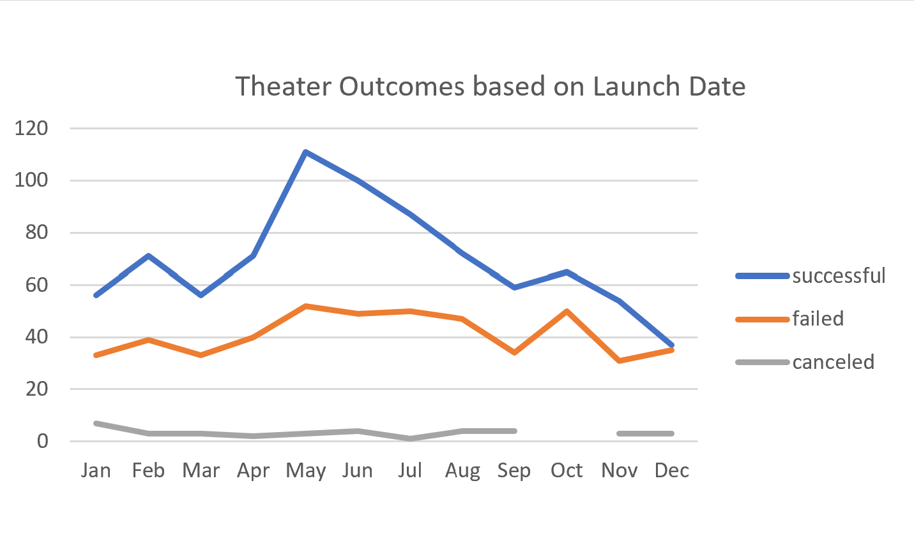
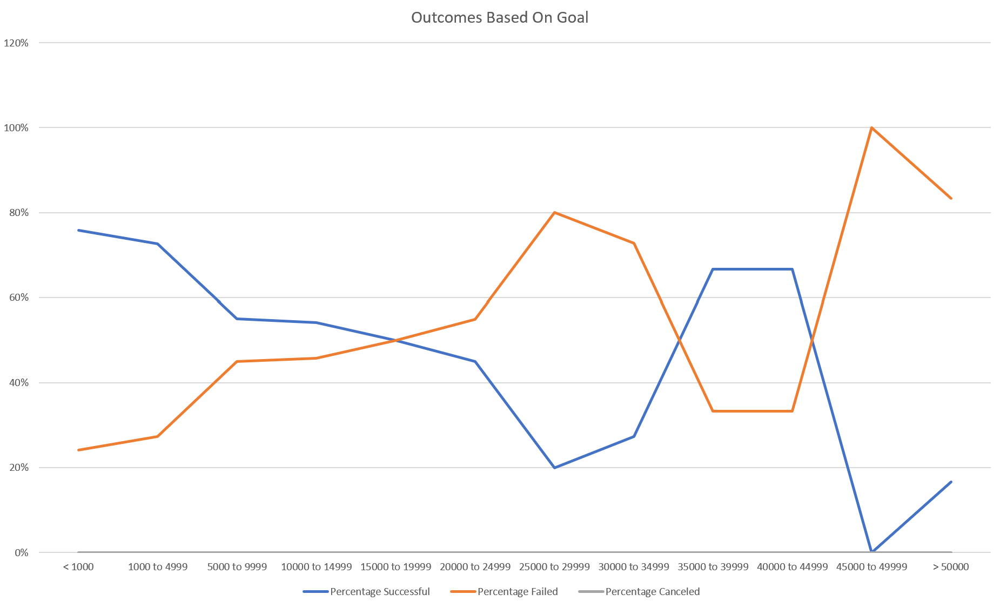

# Campaign Outcomes Based On Their Launch Dates and Their Funding Goals
## Overview
### Purpose
The purpose of this analysis was to use data obtained from a popular crowdfunding website to understand the success rate of Kickstarter campaigns when examining launch dates and funding goals.
## Analysis and Challenges
Data was initially collected from a popular crowdfunding website (N = 4,115) and populated in excel for analysis. 
### Analysis of Outcomes Based on Launch Date
First, a sample was taken from the data to include a count of successful, canceled, and failed campaigns in the theater category (n = 1,369) compared to launch date by month. This was done by creating a pivot table, in which "months of year" was used for rows, and the count of successful, canceled, and failed campaigns was used for columns. A pivot chart was then created from the pivot table, filtering for "years" and by "theater." See Figure 1 below. The total number of successful campaigns was 839, canceled campaigns was 37, and failed campaigns was 493. The months of May and June had the most successful campaigns, at 111 and 100, respectively. The fewest successful campaigns occurred in the months of November and December, at 54 and 37, respectively. May, July, and October had the most failed campaigns at 50, 50, and 52, resepctively. The month with the most canceled campaigns was January, at 7.

### Challenges of Outcomes Based on Launch Date
The challenge of not providing a more robsut understanding of the data arises in the analysis, as this picture of the data does not answer the question of how much more successful the indicated months were. The month of May had both the most successful and the most failed campaigns, which may be misleading if only one of those data points is used without reference to the other. Further more-robust analysis would be needed to answer this question. 

 <b>Figure 1</b>  
 
### Analysis of Outcomes Based on Goals
To analyze the Kickstarter outcomes based on goals, a table was created with the goal amount in $5,000 increments in rows (< $1,000, $1,000-$4,999, $5,000-$9,999, $10,000-$14,999, $15,000-$19,999, $20,000-$24,999, $25,000-$29,999, $30,000-$34,999, $35,000-$39,999, $40,000-$44,999, $45,000-$49,999, and > $50,000). For each goal increment, the number of successful, canceled, and failed campaigns; the total number of campaigns; and the percentage of successful, canceled, and failed campaigns was calculated using the "COUNTSIF()" function in excel. Then, a line chart was created to visualize the percentage of successful, canceled, and failed campaigns by 

 <b>Figure 2</b> 
  
### Challenges of Outcomes Based on Goals

## Results
What are two conclusions you can draw about the Theater Outcomes by Launch Date? In order to have the highest chance of success, it is recommeded to start a Kickstarter campaign in the months of May or June, and it is not recommended to start a campaign in November or December. While the number
What can you conclude about the Outcomes based on Goals?
What are some limitations of this dataset? Limitations include needing to further analyze the data for more robust measures. While , but this needs to be a significant value for it to hold water. 
What are some other possible tables and/or graphs that we could create? To understand 
